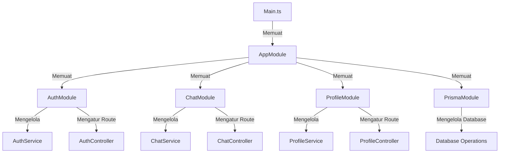
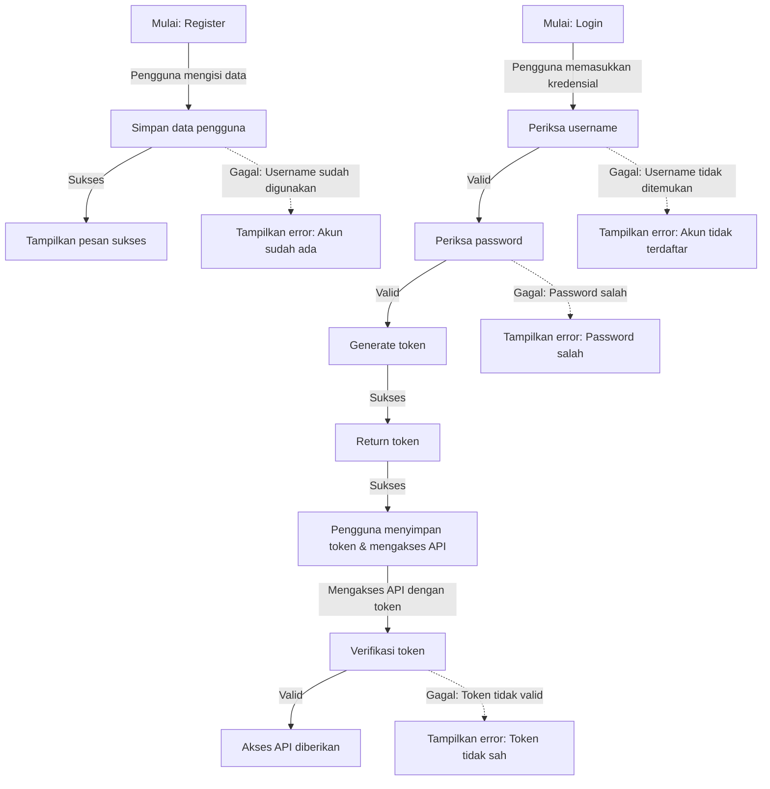
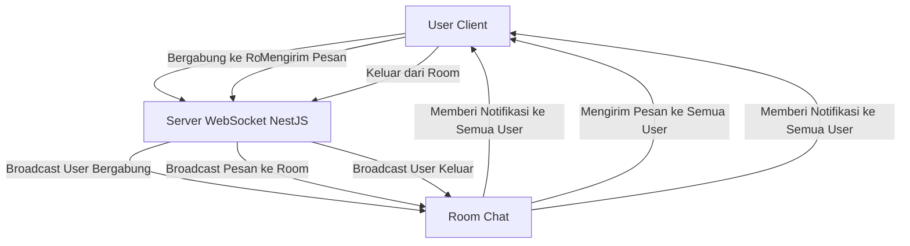

# LAPORAN LAB BACKEND NEST.JS

## 1.PENDAHULUAN
Proyek Lab Backend ini merupakan implementasi sistem backend menggunakan framework **NestJS**, yang dirancang untuk memenuhi kebutuhan aplikasi modern dengan fitur-fitur seperti autentikasi, chat, profil mahasiswa, dan database dengan Prisma. Dalam proyek ini, kami akan membahas tentang bagaimana membangun aplikasi backend yang skalabel, aman, dan mudah dipelihara, serta bagaimana mengintegrasikan teknologi-teknologi seperti WebSockets dan JWT untuk menyediakan komunikasi real-time dan autentikasi pengguna yang aman. Dengan menggunakan contoh-contoh kode yang disediakan, Anda dapat mempelajari bagaimana menerapkan konsep-konsep ini dalam proyek Anda sendiri.

## 2. STRUKTUR PROYEK

Berikut ini adalah struktur proyek **Lab-NestJS**:
```
📦lab-nestjs/
├── 📂node_modules/
├── 📂prisma/
│   ├── prisma.schema
├── 📂public/
│   ├── 🟨app.js
│   ├── 🟧index.html
│   ├── 🟦styles.css
├── 📂src/
│   ├── 📂chat/
│   |   |-- chat.gateaway.spec.ts
│   |   |-- chat.gateaway.ts
│   |   |-- chat.module.ts
│   |   |-- chat.service.spec.ts
│   |   |-- chat.service.ts
│   ├── 📂dto/
│   |   |-- create-mahasiswa.dto.ts
│   |   |-- register-user.dto.ts
│   ├── 📂entity/
│   |   |-- user.entity.ts
│   ├── 📂mahasiswa-profile/
│   |   |-- mahasiswa-profile.controller.spec.ts
│   |   |-- mahasiswa-profile.controller.ts
│   |   |-- mahasiswa-profile.module.ts
│   |   |-- mahasiswa-profile.service.spec.ts
│   |   |-- mahasiswa-profile.service.ts
│   ├── 📂profile/
│   |   |-- profile.controller.spec.ts
│   |   |-- profile.controller.ts
│   |   |-- profile.module.ts
│   |   |-- profile.service.spec.ts
│   |   |-- profile.service.ts
│   |-- app.controller.spec.ts
│   |-- app.controller.ts
│   |-- app.module.ts
│   |-- app.service.ts
│   |-- auth.guard.ts
│   |-- auth.module.ts
│   |-- 🟦main.ts
│   |-- 🟦prisma.ts
│   |-- 🟦user.decorator.ts
├── 📂test/
├── 📂uploads/
├── .env
├── .gitignore
├── .prettierrc
├── nest-cli.json
├── package-lock.json 
├── package.json 
├── README.md 
├── tsconfig.build.json 
├── tsconfig.json 
```

---
## 3. TEKNOLOGI YANG DIGUNAKAN
|Nama|Deskripsi|
|---|---|
|`NestJS`|Framework backend berbasis TypeScript|
|`TypeScript`|Sebagai bahasa pemrograman yang digunakan untuk membuat kode proyek.
|`Prisma`|ORM untuk database.
|`PostgreSQL`|Sebagai database yang digunakan dalam proyek.
|`Swagger`|Sebagai library untuk mengimplementasikan dokumentasi API menggunakan Swagger.
|`WebSockets`|Untuk komunikasi real-time dalam chat.
|`Socket.io`|Sebagai library untuk mengimplementasikan WebSocket.
|`JWT (JSON Web Token)`|Untuk autentikasi pengguna.
---
## 4. INSTALASI PROYEK NEST.JS
1. **Install NestJS CLI**
   ```sh
   npm i -g @nestjs/cli
   ```
2. **Inisialisasi Proyek NestJS**
   ```sh
   nest new nama_proyek
   ```
3. **Masuk Direktori**
   ```sh
   cd nama_proyek
   ```
4. **Setup Swagger**
   ```sh
   npm i –save @nestjs/swagger
   ```
5. **Buka Folder di VSCODE**
   ```sh
   code .
   ```

## 5. PENJELASAN SETIAP FILE
### 1. `prisma/schema.prisma`
File ini berisi definisi model dan enum yang digunakan dalam aplikasi. Berikut adalah penjelasan setiap bagian:

#### a. **Model `Mahasiswa`**
Model ini mendefinisikan tabel untuk menyimpan data mahasiswa dengan kolom-kolom berikut:
- `nim`: Nomor Induk Mahasiswa (NIM)
- `nama`: Nama lengkap mahasiswa
- `kelas`: Kelas tempat mahasiswa bernaung
- `jurusan`: Jurusan yang diambil oleh mahasiswa
- `jenis_kelamin`: Jenis kelamin mahasiswa (Laki-laki / Perempuan)
- `foto_profile`: Foto profil mahasiswa (opsional)

#### b. **Enum `Jenis_Kelamin`**
Enum ini mendefinisikan dua nilai yang valid untuk jenis kelamin mahasiswa:
- `L`: Laki-laki
- `P`: Perempuan

#### c. **Model `User`**
Model ini mendefinisikan tabel untuk menyimpan data pengguna aplikasi dengan kolom-kolom berikut:
- `id`: ID unik pengguna
- `username`: Nama pengguna yang digunakan untuk login
- `password`: Kata sandi pengguna
- `role`: Peran pengguna (ADMIN atau USER)
- `foto_profile`: Foto profil pengguna (opsional)

#### d. **Enum `Role`**
Enum ini mendefinisikan dua peran pengguna yang ada dalam aplikasi:
- `ADMIN`: Pengguna dengan akses penuh ke sistem
- `USER`: Pengguna dengan akses terbatas sesuai peran
2. **src/prisma.ts**
3. **src/user.decorator.ts**
---
### 2. `chat/chat.gateway.spec.ts`
File ini berisi unit test untuk **`ChatGateway`** menggunakan framework **NestJS testing**. Tujuan dari file ini adalah untuk memastikan bahwa **ChatGateway** berfungsi dengan baik.

#### a. **Impor Modul dan Layanan:**
   - `Test`, `TestingModule`: Digunakan untuk membuat dan mengonfigurasi modul pengujian di NestJS.
   - `ChatGateway`: Gateway yang akan diuji.
   - `ChatService`: Layanan yang digunakan oleh **ChatGateway**.

#### b. **Setup Pengujian:**
   - `beforeEach`: Sebelum setiap tes, sebuah modul pengujian dibuat dan dikompilasi. Di dalamnya, **ChatGateway** dan **ChatService** didaftarkan sebagai penyedia.
   - `gateway`: Menyimpan instance dari **ChatGateway** yang siap diuji.

#### c. **Unit Test:**
   - `it('should be defined', ...)`: Memastikan bahwa instance **ChatGateway** telah terdefinisi setelah modul pengujian dibuat dan dikompilasi.
---
### 3. `chat/chat.gateway.ts`
File ini mendefinisikan **WebSocket Gateway** untuk aplikasi chat menggunakan **Socket.IO**:

#### a. **Dekorator `@WebSocketGateway()`**
Dekorator ini mengonfigurasi WebSocket Gateway dengan pengaturan CORS (mengizinkan akses dari semua domain) dan path untuk koneksi WebSocket yaitu `/socket`.

#### b. **Properti `server`**
Menggunakan dekorator `@WebSocketServer()` untuk mendeklarasikan instance **Socket.IO Server** yang digunakan untuk mengirimkan pesan ke semua klien yang terhubung.

#### c. **Manajemen Pengguna**
Data pengguna disimpan dalam map `users` yang memetakan ID socket ke objek yang berisi `username` dan `room`.

#### d. **Fungsi `handleConnection()`**
Menangani koneksi baru ke WebSocket server. ID pengguna yang baru terhubung dicetak di log.

#### e. **Fungsi `handleDisconnect()`**
Menangani pemutusan koneksi dari pengguna. Jika pengguna terhubung ke suatu room, mereka akan dikeluarkan dari room tersebut, dan pesan dikirimkan ke room untuk memberitahukan bahwa pengguna telah keluar.

#### f. **Fungsi `handleJoinRoom()`**
Menangani permintaan untuk bergabung ke room chat tertentu. Fungsi ini memvalidasi `username` dan `room`, kemudian menambahkan pengguna ke dalam room. Pesan akan dikirim ke semua pengguna di room yang memberitahukan bahwa pengguna baru telah bergabung.

#### g. **Fungsi `handleLeaveRoom()`**
Menangani permintaan untuk meninggalkan room. Fungsi ini akan mengeluarkan pengguna dari room yang diikuti dan mengirimkan pesan ke semua pengguna di room bahwa pengguna telah meninggalkan room.

#### h. **Fungsi `handleRoomMessage()`**
Menangani pengiriman pesan dalam room tertentu. Jika `username`, `room`, dan `message` valid, pesan akan disiarkan ke semua pengguna di room tersebut.

---
### 4. `chat/chat.module.ts`
File ini mendefinisikan **ChatModule**, yang merupakan modul utama untuk bagian chat dalam aplikasi.

#### a. **Dekorator `@Module()`**
Dekorator ini digunakan untuk mendeklarasikan sebuah modul di NestJS. Dalam hal ini, modul **ChatModule** berfungsi untuk mengelompokkan provider terkait chat, yaitu:
- **`ChatService`**: Layanan yang mengelola logika bisnis untuk aplikasi chat.
- **`ChatGateway`**: WebSocket gateway yang menangani koneksi real-time dan komunikasi antar pengguna dalam room chat.

#### b. **Providers**
Modul ini menyediakan **`ChatGateway`** dan **`ChatService`** sebagai bagian dari dependensi yang akan disuntikkan ke dalam kelas lain yang membutuhkan layanan ini.

---
### 5. `chat/chat.service.spec.ts`
File ini berisi unit test untuk **`ChatService`**. Tujuan dari file ini adalah untuk memastikan bahwa **ChatService** berfungsi dengan benar dan terdefinisi dengan baik.

#### a. **Impor Modul dan Layanan:**
   - `Test`, `TestingModule`: Digunakan untuk membuat dan mengonfigurasi modul pengujian di NestJS.
   - `ChatService`: Layanan yang diuji dalam file ini.

#### b. **Setup Pengujian:**
   - `beforeEach`: Sebelum setiap pengujian, sebuah modul pengujian dibuat dan dikompilasi. Di dalam modul ini, **ChatService** didaftarkan sebagai provider.
   - `service`: Menyimpan instance dari **ChatService** yang siap diuji.

#### c. **Unit Test:**
   - `it('should be defined', ...)`: Menguji bahwa **ChatService** telah terdefinisi dengan benar setelah modul pengujian dibuat dan dikompilasi. Tes ini memastikan bahwa **ChatService** diinisialisasi dengan baik.

---
### 6. `dto/create-mahasiswa.dto.ts`
File ini berisi definisi **Data Transfer Object (DTO)** untuk membuat data mahasiswa baru. DTO ini digunakan untuk validasi dan mendokumentasikan struktur data yang diterima melalui API.

#### a. **Dekorator `@ApiProperty()`**
Dekorator ini digunakan untuk mendokumentasikan properti pada DTO menggunakan **Swagger**, sehingga API dapat menghasilkan dokumentasi yang jelas mengenai tipe dan contoh data yang diharapkan.

#### b. **Properti pada DTO:**
1. **`nim` (NIM Mahasiswa)**
   - Tipe data: `string`
   - Validasi:
     - Harus berupa string (`@IsString`).
     - Tidak boleh kosong (`@IsNotEmpty`).
     - Panjangnya antara 1 sampai 12 karakter (`@Length(1, 12)`).
   - Deskripsi: Menyimpan Nomor Induk Mahasiswa.

2. **`nama` (Nama Mahasiswa)**
   - Tipe data: `string`
   - Validasi:
     - Harus berupa string (`@IsString`).
     - Tidak boleh kosong (`@IsNotEmpty`).
     - Panjangnya antara 1 sampai 50 karakter (`@Length(1, 50)`).
   - Deskripsi: Menyimpan nama lengkap mahasiswa.

3. **`Kelas`**
   - Tipe data: `string`
   - Validasi:
     - Harus berupa string (`@IsString`).
     - Tidak boleh kosong (`@IsNotEmpty`).
     - Panjangnya antara 1 sampai 2 karakter (`@Length(1, 2)`).
   - Deskripsi: Menyimpan kelas tempat mahasiswa bernaung.

4. **`jurusan` (Jurusan Mahasiswa)**
   - Tipe data: `string`
   - Validasi:
     - Harus berupa string (`@IsString`).
     - Tidak boleh kosong (`@IsNotEmpty`).
     - Panjangnya antara 1 sampai 12 karakter (`@Length(1, 12)`).
   - Deskripsi: Menyimpan jurusan yang diambil mahasiswa.

5. **`jenis_kelamin` (Jenis Kelamin Mahasiswa)**
   - Tipe data: `Jenis_Kelamin` (Enum yang berasal dari Prisma)
   - Validasi:
     - Harus berupa nilai enum (`@IsEnum`), dengan nilai yang valid hanya `L` atau `P`.
   - Deskripsi: Menyimpan jenis kelamin mahasiswa yang hanya bisa bernilai `L` (Laki-laki) atau `P` (Perempuan).

---
### 7. `dto/register-user.dto.ts`
File ini berisi definisi **Data Transfer Object (DTO)** untuk mendaftarkan pengguna baru dalam aplikasi. DTO ini digunakan untuk memvalidasi dan mendokumentasikan data pengguna yang diterima melalui API.

#### - **Dekorator `@ApiProperty()`**
Dekorator ini digunakan untuk mendokumentasikan properti dalam DTO menggunakan **Swagger**, untuk menghasilkan dokumentasi API yang jelas mengenai tipe dan contoh data yang diharapkan.

#### a. **Properti pada DTO:**
1. **`username` (Nama Pengguna)**
   - Tipe data: `string`
   - Validasi:
     - Harus berupa string (`@IsString`).
     - Tidak boleh kosong (`@IsNotEmpty`).
     - Tidak boleh mengandung spasi (validasi menggunakan `@Matches(/^\S*$/i)` untuk memastikan hanya karakter non-spasi).
     - Panjangnya antara 1 hingga 30 karakter (`@Length(1, 30)`).
   - Deskripsi: Menyimpan nama pengguna yang digunakan untuk login ke aplikasi.

2. **`password` (Kata Sandi)**
   - Tipe data: `string`
   - Validasi:
     - Harus berupa string (`@IsString`).
     - Tidak boleh kosong (`@IsNotEmpty`).
     - Tidak boleh mengandung spasi (validasi menggunakan `@Matches(/^\S*$/i)` untuk memastikan hanya karakter non-spasi).
     - Panjangnya antara 1 hingga 30 karakter (`@Length(1, 30)`).
   - Deskripsi: Menyimpan kata sandi yang digunakan untuk login ke aplikasi.

---
### 8. `entity/user.entity.ts`
File ini berisi definisi **Entity** untuk pengguna dalam aplikasi, yang digunakan untuk memetakan data pengguna ke dalam objek yang dapat digunakan oleh aplikasi. Entity ini juga menggunakan **class-transformer** untuk mengatur properti mana yang akan diekspos dan disembunyikan saat data pengguna diproses.

#### a. **Properti pada Entity:**
1. **`id` (ID Pengguna)**
   - Tipe data: `number`
   - Deskripsi: Menyimpan ID unik pengguna yang terdaftar dalam sistem.
   - Dekorator `@Expose()`: Menandakan bahwa properti ini akan diekspos dalam proses serialisasi objek.

2. **`username` (Nama Pengguna)**
   - Tipe data: `string`
   - Deskripsi: Menyimpan nama pengguna yang digunakan untuk login.
   - Dekorator `@Expose()`: Menandakan bahwa properti ini akan diekspos dalam proses serialisasi objek.

3. **`password` (Kata Sandi)**
   - Tipe data: `string`
   - Deskripsi: Menyimpan kata sandi pengguna (tidak akan diekspos untuk keamanan).
   - Dekorator `@Exclude()`: Menandakan bahwa properti ini tidak akan disertakan dalam proses serialisasi objek untuk mencegah kebocoran informasi sensitif.

4. **`role` (Peran Pengguna)**
   - Tipe data: `Role` (Enum dari Prisma)
   - Deskripsi: Menyimpan peran pengguna dalam aplikasi (misalnya, ADMIN atau USER).
   - Dekorator `@Expose()`: Menandakan bahwa properti ini akan diekspos dalam proses serialisasi objek.

5. **`foto_profile` (Foto Profil Pengguna)**
   - Tipe data: `string`
   - Deskripsi: Menyimpan URL atau nama file foto profil pengguna.
   - Dekorator `@Expose()`: Menandakan bahwa properti ini akan diekspos dalam proses serialisasi objek.
---
### 9. `mahasiswa-profile/mahasiswa-profile.controller.ts`
File ini berisi **Controller** untuk menangani API terkait pengelolaan foto profil mahasiswa, termasuk untuk meng-upload dan mengambil foto profil berdasarkan **NIM**.

#### a. **Dekorator `@Controller()`**
Dekorator ini mendefinisikan rute dasar untuk controller ini, yaitu `mahasiswa-profile`.

#### b. **Rute API:**

1. **`POST /mahasiswa-profile/upload`**  
   - Fungsi: Meng-upload foto profil mahasiswa.
   - Deskripsi: Endpoint ini menerima file foto profil dan **NIM** mahasiswa sebagai input. File tersebut akan disimpan menggunakan service `MahasiswaProfileService`.
   - **Dekorator:**
     - `@ApiOperation()`: Menyediakan deskripsi untuk dokumentasi Swagger.
     - `@ApiConsumes()`: Menentukan tipe konten yang diterima, yaitu `multipart/form-data` untuk file upload.
     - `@ApiBody()`: Menyediakan schema body untuk mendokumentasikan input API.
     - `@UseInterceptors()`: Menggunakan `FileInterceptor` untuk menangani file upload.
   - Validasi:
     - Jika file tidak ada, akan melemparkan **BadRequestException** dengan pesan "File tidak boleh kosong!".
     - Jika **NIM** tidak ada, akan melemparkan **BadRequestException** dengan pesan "NIM tidak boleh kosong!".
   - Menyerahkan pengolahan file ke service `mahasiswaProfileService.uploadFile()`.

2. **`GET /mahasiswa-profile/:nim`**  
   - Fungsi: Mengambil foto profil mahasiswa berdasarkan **NIM**.
   - Deskripsi: Endpoint ini mencari foto profil yang terasosiasi dengan **NIM** mahasiswa yang diberikan, kemudian mengirimkan file tersebut ke klien.
   - **Dekorator:**
     - `@ApiOperation()`: Menyediakan deskripsi untuk dokumentasi Swagger.
   - Validasi:
     - Jika foto profil tidak ditemukan untuk **NIM** yang diberikan, maka akan melemparkan **NotFoundException** dengan pesan "Foto profil tidak ditemukan!".
     - Jika file tidak ditemukan di server, maka akan melemparkan **NotFoundException** dengan pesan "File tidak ditemukan di server".
   - File profil diambil dari server menggunakan `sendMyFotoProfile()` dari `mahasiswaProfileService` dan dikirim ke klien menggunakan `res.sendFile()`.
---
### 10. `mahasiswa-profile/mahasiswa-profile.service.ts`
File ini berisi **Service** yang menangani logika bisnis terkait pengelolaan foto profil mahasiswa, termasuk meng-upload foto dan mengambil foto profil berdasarkan **NIM** mahasiswa.

#### a. **Metode `uploadFile()`**
Fungsi ini bertanggung jawab untuk meng-upload foto profil mahasiswa ke server dan memperbarui informasi foto profil di database.

1. **Langkah-langkah:**
   - Mengambil data mahasiswa berdasarkan **NIM** yang diberikan.
   - Jika mahasiswa tidak ditemukan, melemparkan **NotFoundException**.
   - Memastikan direktori `uploads` ada, jika belum maka membuatnya.
   - Menyusun nama file unik dengan menggunakan **NIM** mahasiswa, timestamp, dan ekstensi file.
   - Menulis file yang diterima ke dalam direktori `uploads`.
   - Memperbarui field `foto_profile` pada data mahasiswa di database dengan nama file yang baru.

2. **Validasi:**
   - Jika mahasiswa dengan **NIM** yang diberikan tidak ditemukan, melemparkan **NotFoundException** dengan pesan "User tidak ditemukan!".

3. **Output:**
   - Mengembalikan objek yang berisi nama file dan path file yang disimpan di server.

#### b. **Metode `sendMyFotoProfile()`**
Fungsi ini bertanggung jawab untuk mengembalikan nama file foto profil mahasiswa berdasarkan **NIM** yang diberikan.

1. **Langkah-langkah:**
   - Mencari data mahasiswa berdasarkan **NIM** yang diberikan.
   - Jika mahasiswa tidak ditemukan atau tidak memiliki foto profil, melemparkan **NotFoundException** dengan pesan "Foto profil tidak ditemukan".
   - Mengembalikan nama file foto profil mahasiswa.

2. **Validasi:**
   - Jika mahasiswa dengan **NIM** yang diberikan tidak ditemukan atau tidak memiliki foto profil, melemparkan **NotFoundException** dengan pesan "Foto profil tidak ditemukan".
---
### 11. `profile/profile.controller.ts`
File ini berisi **Controller** untuk menangani API terkait pengelolaan foto profil pengguna. Controller ini berfungsi untuk meng-upload dan mengambil foto profil pengguna menggunakan **NestJS**.

#### a. **Rute API:**

1. **`POST /profile/upload`**
   - Fungsi: Meng-upload foto profil pengguna.
   - Deskripsi: Endpoint ini menerima file foto profil yang akan di-upload. File disertakan dalam body permintaan dan diproses menggunakan **Multer**.
   - **Dekorator:**
     - `@UseInterceptors(FileInterceptor('file'))`: Menggunakan interceptor untuk menangani upload file.
   - Validasi:
     - Jika tidak ada file yang di-upload, akan melemparkan **BadRequestException** dengan pesan "File tidak boleh kosong!!".
   - Fungsi ini memanggil `profileService.uploadFile()` untuk menangani proses upload dan menyimpan file.

2. **`GET /profile/:id`**
   - Fungsi: Mengambil foto profil pengguna berdasarkan **ID** pengguna.
   - Deskripsi: Endpoint ini mengembalikan file foto profil pengguna berdasarkan **ID** yang diberikan dalam parameter URL. Foto profil diambil dari folder `uploads` dan dikirimkan ke klien.
   - Validasi:
     - Fungsi ini memanggil `profileService.sendMyFotoProfile()` untuk mengambil nama file foto profil berdasarkan **ID** pengguna, dan mengembalikannya ke klien.
   - Menggunakan `@Res()` untuk mengirim file gambar ke pengguna menggunakan **express**.
---
### 12. `profile/profile.service.ts`
File ini berisi **Service** yang menangani logika bisnis terkait pengelolaan foto profil pengguna, termasuk meng-upload dan menghapus foto profil yang ada.

#### a. **Metode `uploadFile()`**
Fungsi ini bertanggung jawab untuk meng-upload foto profil pengguna ke server dan memperbarui informasi foto profil di database.

1. **Langkah-langkah:**
   - Mencari pengguna berdasarkan **ID** yang diberikan menggunakan **Prisma ORM**.
   - Jika pengguna tidak ditemukan, melemparkan **NotFoundException** dengan pesan "Tidak Menemukan User".
   - Jika pengguna sudah memiliki foto profil, file foto lama dihapus dari server.
   - Memastikan direktori `uploads` ada, jika belum maka membuatnya.
   - Menyusun nama file unik dengan menggunakan **username** pengguna, timestamp, dan ekstensi file.
   - Menulis file yang diterima ke dalam direktori `uploads`.
   - Memperbarui field `foto_profile` pada data pengguna di database dengan nama file yang baru.

2. **Validasi:**
   - Jika pengguna dengan **ID** yang diberikan tidak ditemukan, melemparkan **NotFoundException** dengan pesan "Tidak Menemukan User".

3. **Output:**
   - Mengembalikan objek yang berisi nama file dan path file yang disimpan di server.

#### b. **Metode `sendMyFotoProfile()`**
Fungsi ini bertanggung jawab untuk mengembalikan nama file foto profil pengguna berdasarkan **ID** yang diberikan.

1. **Langkah-langkah:**
   - Mencari data pengguna berdasarkan **ID** yang diberikan.
   - Jika pengguna tidak ditemukan, melemparkan **NotFoundException** dengan pesan "Tidak Menemukan User".
   - Mengembalikan nama file foto profil pengguna.

2. **Validasi:**
   - Jika pengguna dengan **ID** yang diberikan tidak ditemukan, melemparkan **NotFoundException** dengan pesan "Tidak Menemukan User".
---
### 13. `src/app.controller.ts`
File ini berisi **Controller** yang menangani berbagai rute API untuk aplikasi mahasiswa, termasuk pendaftaran, login, pengelolaan data mahasiswa, dan pencarian mahasiswa. Controller ini menyediakan autentikasi dan mengelola CRUD (Create, Read, Update, Delete) data mahasiswa.

#### a. **Rute API:**

1. **`POST /register`**
   - Fungsi: Mendaftarkan pengguna baru.
   - Deskripsi: Endpoint ini menerima data pengguna baru, seperti username dan password, untuk mendaftarkan akun pengguna baru.
   - **Dekorator:**
     - `@ApiBody()`: Mendokumentasikan tipe data `RegisterUserDTO`.
   - Mengarahkan permintaan ke `appService.register()` untuk memproses pendaftaran pengguna.

2. **`POST /login`**
   - Fungsi: Login pengguna dan mengembalikan token autentikasi.
   - Deskripsi: Endpoint ini menerima data pengguna dan mengembalikan token autentikasi yang digunakan untuk mengakses rute yang dilindungi.
   - **Dekorator:**
     - `@ApiBody()`: Mendokumentasikan tipe data `RegisterUserDTO`.
     - Menggunakan `res.cookie()` untuk mengatur cookie dengan token.
   - Mengarahkan permintaan ke `appService.login()` untuk memproses login.

3. **`GET /`**
   - Fungsi: Mengembalikan pesan hello dari aplikasi.
   - Deskripsi: Endpoint ini hanya untuk pengujian dan demonstrasi.

4. **`GET /mahasiswa`**
   - Fungsi: Mengambil data mahasiswa.
   - Deskripsi: Endpoint ini mengembalikan daftar semua mahasiswa.
   - Mengarahkan permintaan ke `appService.getMahasiswa()`.

5. **`GET /mahasiswa/:nim`**
   - Fungsi: Mengambil data mahasiswa berdasarkan **NIM**.
   - Deskripsi: Endpoint ini mengembalikan data mahasiswa berdasarkan **NIM** yang diberikan.
   - Mengarahkan permintaan ke `appService.getMahasiswByNim()`.

6. **`GET /auth`**
   - Fungsi: Mengembalikan informasi pengguna yang sedang login.
   - Deskripsi: Endpoint ini hanya dapat diakses jika pengguna telah terautentikasi menggunakan **AuthGuard**.
   - **Dekorator:**
     - `@ApiBearerAuth()`: Menyediakan dokumentasi untuk autentikasi menggunakan token.
   - Menggunakan `@UserDecorator()` untuk mendapatkan informasi pengguna yang sedang login.

7. **`POST /mahasiswa`**
   - Fungsi: Menambahkan data mahasiswa baru.
   - Deskripsi: Endpoint ini menerima data mahasiswa baru dan menambahkannya ke database.
   - **Dekorator:**
     - `@ApiBody()`: Mendokumentasikan tipe data `CreateMahasiswaDTO`.
   - Mengarahkan permintaan ke `appService.addMahasiswa()`.

8. **`PUT /mahasiswa/:nim`**
   - Fungsi: Memperbarui data mahasiswa berdasarkan **NIM**.
   - Deskripsi: Endpoint ini memperbarui data mahasiswa yang ada berdasarkan **NIM** yang diberikan.
   - **Dekorator:**
     - `@ApiBody()`: Mendokumentasikan tipe data `CreateMahasiswaDTO`.
   - Mengarahkan permintaan ke `appService.updateMahasiswa()`.

9. **`DELETE /mahasiswa/:nim`**
   - Fungsi: Menghapus data mahasiswa berdasarkan **NIM**.
   - Deskripsi: Endpoint ini menghapus data mahasiswa yang ada berdasarkan **NIM** yang diberikan.
   - Mengarahkan permintaan ke `appService.menghapusMahasiswa()`.

10. **`GET /pencarian/mahasiswa`**
    - Fungsi: Mencari mahasiswa berdasarkan **NIM**, **nama**, atau **jurusan**.
    - Deskripsi: Endpoint ini menerima parameter pencarian seperti **NIM**, **nama**, dan **jurusan**, kemudian mencari mahasiswa yang sesuai.
    - **Dekorator:**
      - `@ApiQuery()`: Mendokumentasikan parameter query `nim`, `nama`, dan `jurusan` untuk pencarian.
    - Mengarahkan permintaan ke `appService.pencarianMahasiswa()`.
---
### 14. `src/app.module.ts`
File ini mendefinisikan **AppModule**, yang merupakan modul utama dalam aplikasi. Modul ini mengonfigurasi berbagai dependensi dan menghubungkan berbagai bagian aplikasi, seperti controller, service, dan modul lainnya.

#### a. **Dekorator `@Module()`**
Dekorator ini digunakan untuk mendeklarasikan modul dan menyediakan konfigurasi untuk aplikasi. Beberapa bagian penting dalam dekorator ini adalah:

1. **`imports`**:
   - `JwtModule.register()`: Mengonfigurasi **JWT (JSON Web Token)** dengan `secret` untuk otentikasi pengguna. Ini digunakan untuk menangani otentikasi berbasis token di aplikasi.
   - `ProfileModule`: Modul ini bertanggung jawab untuk menangani foto profil pengguna, termasuk upload dan pengambilan foto profil.
   - `ChatModule`: Modul ini menangani fitur chat real-time menggunakan WebSocket.
   - `MahasiswaProfileModule`: Modul ini bertanggung jawab untuk mengelola data profil mahasiswa, termasuk upload dan pengambilan foto profil mahasiswa.

2. **`controllers`**:
   - `AppController`: Controller utama untuk aplikasi ini, yang menangani berbagai rute API terkait dengan pendaftaran, login, pengelolaan data mahasiswa, dan autentikasi.

3. **`providers`**:
   - `AppService`: Layanan yang menyediakan logika bisnis aplikasi terkait pengguna, mahasiswa, dan autentikasi.
   - `PrismaService`: Layanan untuk menghubungkan aplikasi dengan database menggunakan **Prisma ORM**.
---
### 15. `src/app.service.ts`
File ini berisi **Service** yang menangani logika bisnis utama untuk aplikasi, termasuk registrasi pengguna, autentikasi, pengelolaan mahasiswa, dan pencarian mahasiswa. Service ini berinteraksi dengan database menggunakan **Prisma ORM** dan menyediakan berbagai operasi CRUD (Create, Read, Update, Delete) terkait data mahasiswa.

#### a. **Metode `register()`**
Fungsi ini bertanggung jawab untuk mendaftarkan pengguna baru.

1. **Langkah-langkah:**
   - Memeriksa apakah username sudah terdaftar di database.
   - Jika username sudah ada, melemparkan **BadRequestException**.
   - Mengenkripsi password menggunakan **bcrypt**.
   - Membuat pengguna baru di database dengan data yang diberikan.

2. **Validasi:**
   - Jika username sudah digunakan, melemparkan **BadRequestException** dengan pesan "Username ini Sudah Digunakan".
   - Jika terjadi masalah pada server, melemparkan **InternalServerErrorException**.

#### b. **Metode `login()`**
Fungsi ini bertanggung jawab untuk login pengguna dan mengembalikan token autentikasi.

1. **Langkah-langkah:**
   - Mencari pengguna berdasarkan username.
   - Jika pengguna tidak ditemukan, melemparkan **NotFoundException**.
   - Memvalidasi password yang diberikan menggunakan **bcrypt**.
   - Menghasilkan token JWT yang berisi payload yang mencakup `id`, `username`, dan `role`.

2. **Validasi:**
   - Jika password tidak cocok, melemparkan **BadRequestException** dengan pesan "Password Salah".
   - Jika terjadi masalah pada server, melemparkan **InternalServerErrorException**.

#### c. **Metode `auth()`**
Fungsi ini mengembalikan informasi pengguna yang sedang login berdasarkan **user_id**.

1. **Langkah-langkah:**
   - Mencari pengguna berdasarkan **user_id**.
   - Jika pengguna tidak ditemukan, melemparkan **NotFoundException**.

#### d. **Metode `getMahasiswa()`**
Fungsi ini mengembalikan daftar mahasiswa dari database.

#### e. **Metode `addMahasiswa()`**
Fungsi ini bertanggung jawab untuk menambahkan data mahasiswa baru.

1. **Langkah-langkah:**
   - Memeriksa apakah mahasiswa dengan **NIM** yang diberikan sudah ada.
   - Jika sudah ada, melemparkan **NotFoundException**.
   - Menambahkan data mahasiswa baru ke database.

#### f. **Metode `getMahasiswByNim()`**
Fungsi ini mengembalikan data mahasiswa berdasarkan **NIM**.

1. **Langkah-langkah:**
   - Mencari mahasiswa berdasarkan **NIM**.
   - Jika mahasiswa tidak ditemukan, melemparkan **NotFoundException**.

#### g. **Metode `menghapusMahasiswa()`**
Fungsi ini menghapus data mahasiswa berdasarkan **NIM**.

1. **Langkah-langkah:**
   - Mencari mahasiswa berdasarkan **NIM**.
   - Jika mahasiswa tidak ditemukan, melemparkan **NotFoundException**.
   - Menghapus data mahasiswa dari database.

#### h. **Metode `updateMahasiswa()`**
Fungsi ini memperbarui data mahasiswa berdasarkan **NIM**.

1. **Langkah-langkah:**
   - Mencari mahasiswa berdasarkan **NIM**.
   - Jika mahasiswa tidak ditemukan, melemparkan **NotFoundException**.
   - Memperbarui data mahasiswa yang ditemukan.

#### i. **Metode `pencarianMahasiswa()`**
Fungsi ini mencari mahasiswa berdasarkan **NIM**, **nama**, dan **jurusan**.

1. **Langkah-langkah:**
   - Mencari mahasiswa dengan parameter pencarian yang diberikan.
   - Jika tidak ditemukan, melemparkan **Error** dengan pesan "Tidak Menemukan Mahasiswa".
---
### 16. `src/auth.guard.ts`
File ini berisi **AuthGuard**, yang merupakan pengawal (guard) untuk mengamankan rute API dengan memverifikasi autentikasi berbasis token menggunakan **JWT** (JSON Web Token). Pengawal ini memastikan bahwa hanya pengguna yang terotentikasi yang dapat mengakses rute tertentu.

#### a. **Dekorator `@Injectable()`**
Dekorator ini digunakan untuk menandakan bahwa **AuthGuard** adalah sebuah layanan yang dapat disuntikkan ke dalam komponen lainnya di aplikasi.

#### b. **Metode `canActivate()`**
Metode ini bertanggung jawab untuk memeriksa apakah pengguna memiliki izin untuk mengakses rute yang dilindungi. Berikut langkah-langkah yang dilakukan dalam metode ini:

1. **Mengambil Header Authorization**:
   - Mengambil header **Authorization** dari permintaan HTTP untuk memeriksa token autentikasi yang dikirimkan oleh pengguna.

2. **Memeriksa Keberadaan Authorization Header**:
   - Jika header **Authorization** tidak ditemukan, maka **UnauthorizedException** dilemparkan dengan pesan "Authorization header is missing".

3. **Memvalidasi Token JWT**:
   - Token yang terdapat dalam header **Authorization** diambil (dalam format "Bearer <token>").
   - Token diverifikasi menggunakan **JwtService** untuk memastikan token tersebut valid.
   - Jika token tidak valid atau terjadi kesalahan lainnya, maka **UnauthorizedException** dilemparkan dengan pesan "Invalid token".

4. **Mencari Pengguna Berdasarkan Payload**:
   - Setelah token diverifikasi, **payload** yang berisi **user id** diambil dan digunakan untuk mencari informasi pengguna menggunakan metode `auth()` dari **AppService**.
   - Pengguna yang ditemukan kemudian disalin ke dalam objek **request.user** menggunakan **plainToInstance()**, agar bisa diakses di dalam handler rute.

5. **Keputusan Akses**:
   - Jika semua langkah di atas berhasil dilakukan tanpa masalah, maka rute diizinkan untuk diakses dengan mengembalikan **true**.
---
### 17. `src/auth.module.ts`
File ini berisi **AuthModule**, yang bertanggung jawab untuk menyediakan layanan autentikasi di aplikasi menggunakan **NestJS**. Modul ini bersifat **Global**, yang berarti layanan yang disediakan oleh modul ini dapat diakses di seluruh aplikasi tanpa perlu diimpor lagi di modul lain.

#### a. **Dekorator `@Global()`**
Dekorator ini menandakan bahwa **AuthModule** adalah modul global. Layanan yang diekspor dari modul ini, seperti `AppService` dan `PrismaService`, dapat diakses di modul lain tanpa perlu menyertakan modul ini dalam impor mereka.

#### b. **Dekorator `@Module()`**
Dekorator ini mendeklarasikan dan mengonfigurasi modul **AuthModule**. Berikut adalah komponen-komponen penting dalam dekorator ini:

1. **`providers`**:
   - `AppService`: Layanan yang mengelola logika bisnis terkait pengguna, mahasiswa, dan autentikasi.
   - `PrismaService`: Layanan yang bertanggung jawab untuk menghubungkan aplikasi dengan database menggunakan **Prisma ORM**.

2. **`exports`**:
   - **AuthModule** mengekspor **`AppService`** dan **`PrismaService`** agar layanan-layanan ini bisa digunakan di modul-modul lain dalam aplikasi.
---
### 18. `src/main.ts`
File ini merupakan titik masuk utama untuk aplikasi NestJS. Di dalamnya, aplikasi dikonfigurasi, dijalankan, dan pengaturan tambahan seperti Swagger dan global pipes ditambahkan.

#### a. **Deklarasi dan Pembuatan Aplikasi NestJS**
1. **`NestFactory.create(AppModule)`**:
   - Membuat instance aplikasi menggunakan **AppModule** yang telah didefinisikan sebelumnya.
   - **AppModule** berisi konfigurasi utama aplikasi, seperti routing, middleware, dan provider.

2. **`app.use(cookieParser())`**:
   - Menambahkan middleware **cookie-parser** untuk mem-parsing cookies yang diterima dari klien.
   - Membantu dalam membaca dan memproses cookie yang dikirim dalam permintaan HTTP.

3. **`app.enableCors()`**:
   - Mengonfigurasi Cross-Origin Resource Sharing (**CORS**) untuk aplikasi, yang memungkinkan aplikasi menerima permintaan dari sumber lain (dalam hal ini, `*` untuk menerima permintaan dari semua asal).

4. **`app.useGlobalPipes(new ValidationPipe({ transform: true }))`**:
   - Menambahkan global validation pipe untuk memvalidasi dan mengubah data input secara otomatis.
   - **`ValidationPipe`** memeriksa kesalahan pada body request dan memastikan bahwa data sesuai dengan aturan yang ditentukan.
   - Opsi `transform: true` memungkinkan otomatis mengubah data menjadi tipe yang sesuai berdasarkan DTO.

#### b. **Swagger Setup**
1. **`DocumentBuilder`**:
   - Membuat konfigurasi untuk **Swagger** dokumentasi API. Mengatur:
     - **Title**: Judul dokumentasi API.
     - **Description**: Deskripsi API.
     - **Version**: Versi API.
     - **Tag**: Menambahkan tag untuk kategori API (dalam hal ini, "Kelas - C").
     - **BearerAuth**: Menambahkan autentikasi Bearer Token untuk API.

2. **`SwaggerModule.createDocument()`**:
   - Membuat dokumentasi API berdasarkan konfigurasi yang telah dibuat.
   - `app` digunakan untuk menghasilkan dokumentasi sesuai dengan pengaturan yang diberikan.

3. **`SwaggerModule.setup()`**:
   - Menyediakan rute **`/api-docs`** yang digunakan untuk mengakses dokumentasi API secara interaktif melalui Swagger UI.

#### c. **Menjalankan Aplikasi**
1. **`await app.listen(process.env.PORT ?? 3000)`**:
   - Menjalankan aplikasi pada port yang ditentukan oleh variabel lingkungan `PORT`, atau default ke `3000` jika tidak ada port yang ditentukan.
---
### 19. `src/user.decorator.ts`
File ini berisi **custom decorator** yang dibuat untuk mengambil informasi pengguna yang terautentikasi dari objek permintaan (**request**). Decorator ini memudahkan akses ke data pengguna dalam handler rute yang dilindungi oleh **AuthGuard**.

#### a. **Dekorator `@UserDecorator()`**
Dekorator ini digunakan untuk mengambil data pengguna yang telah diautentikasi dan disimpan dalam objek permintaan (`request.user`) oleh **AuthGuard**.

1. **Fungsi `createParamDecorator()`**:
   - `createParamDecorator` adalah fungsi dari NestJS yang digunakan untuk membuat decorator kustom yang bisa digunakan untuk parameter metode di controller.
   - Decorator ini menerima dua parameter:
     - **`data`**: Data opsional yang dapat diteruskan ke decorator (tidak digunakan dalam contoh ini).
     - **`ctx` (ExecutionContext)**: Konteks eksekusi untuk permintaan HTTP saat ini.
   
2. **Logika di dalam decorator**:
   - Dalam body decorator, kita mengambil objek permintaan (`request`) dari **ExecutionContext** dan mengakses properti `user` dari objek permintaan, yang berisi informasi pengguna yang terautentikasi.
   - `request.user` biasanya di-set oleh **AuthGuard** setelah token validasi dan pengguna ditemukan.
---
### 20. `.env`
File ini berisi **environment variables** yang digunakan untuk konfigurasi aplikasi, khususnya untuk pengaturan koneksi ke database yang digunakan oleh aplikasi. Variabel dalam file ini akan secara otomatis diakses oleh Prisma untuk menghubungkan aplikasi ke database.

---
### 21. `.gitignore`
File ini digunakan untuk menentukan file dan direktori mana yang harus diabaikan oleh **Git**. File ini penting untuk memastikan bahwa file atau folder yang tidak perlu atau bersifat pribadi (seperti file konfigurasi lokal, node_modules, dll.) tidak masuk ke dalam repositori Git.

---
### 22. `package-lock.json`
File ini otomatis dihasilkan oleh **npm** untuk mengunci versi dependensi yang digunakan dalam proyek. **`package-lock.json`** memastikan bahwa setiap orang yang meng-clone proyek ini akan menggunakan versi yang sama dari setiap paket yang digunakan, untuk menghindari masalah ketergantungan.

---
### 23. `package.json`
File ini berisi metadata tentang proyek, termasuk:
- **Dependensi** yang digunakan dalam proyek (seperti NestJS, Prisma, dll).
- **Script** untuk menjalankan berbagai tugas, seperti `npm run start` untuk menjalankan aplikasi.
- **Versi** proyek dan informasi pengembang.

---
### 24. `README.md`
File ini digunakan untuk memberikan dokumentasi tentang proyek kepada pengembang lain atau pengguna aplikasi.

---
## 6. DIAGRAM ARSITEKTUR

Berikut diagram arsitektur proyek dalam bentuk flowchart visual:


Diagram ini menunjukkan bagaimana modul saling terhubung dan bagaimana aliran data terjadi di dalam aplikasi **Lab-NestJS**.

---

## 7. ALUR KERJA REGISTER USER, LOGIN DAN AUTHENTICATION

---
## 8. ALUR SKEMA ALUR CHAT ROOM DENGAN WEBSOCKET

---

## 9. CARA MENJALANKAN PROYEK

1. **Clone repository:**
   ```sh
   git clone <repo-url>
   cd lab-nestjs
   ```

2. **Install dependencies:**
   ```sh
   npm install
   ```

3. **Menjalankan server:**
   ```sh
   npm start
   npm run start:dev
   ```

4. **Akses API di:**
   ```sh
   http://localhost:3000
   http://localhost:3000/api-docs  --> Swagger
   ```


## 10. KESIMPULAN
Proyek ini adalah implementasi backend menggunakan NestJS dengan beberapa modul utama, termasuk autentikasi, chat, profil mahasiswa, dan database dengan Prisma. Dengan menggunakan teknologi seperti WebSockets dan JWT, proyek ini dapat menyediakan komunikasi real-time dan autentikasi pengguna yang aman.